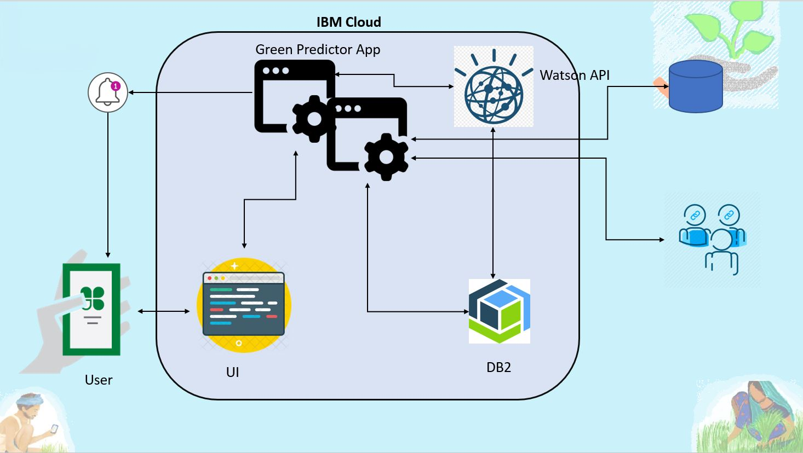

# Green Predictor

  

A basic GitHub repository example for new [Call for Code](https://developer.ibm.com/callforcode/) projects and those that join the Call for Code with The Linux Foundation deployment initiative. Not all sections or files are required. You can make this as simple or as in-depth as you need. And don't forget to [register for Call for Code 2021](https://developer.ibm.com/callforcode/get-started/)!

> If you're new to open source, please consider taking the [free "Introduction to Open Source" class](https://cognitiveclass.ai/courses/introduction-to-open-source).

_Read this in other languages: [English](README.md), [한국어](./docs/README.ko.md), [português](./docs/README.pt_br.md)._

## Contents

- [Submission or project name](#submission-or-project-name)
  - [Contents](#contents)
  - [Short description](#short-description)
    - [What's the problem?](#whats-the-problem)
    - [How can technology help?](#how-can-technology-help)
    - [The idea](#the-idea)
  - [Demo video](#demo-video)
  - [The architecture](#the-architecture)
  - [Project roadmap](#project-roadmap)
  - [Getting started](#getting-started)
  - [Live demo](#live-demo)
  - [Built with](#built-with)
  - [Contributing](#contributing)
  - [Versioning](#versioning)
  - [Authors](#authors)
  - [License](#license)
  - [Acknowledgments](#acknowledgments)

## Short description

### What's the problem?

Rs 13,300 crore vegies and fruit is wasted annually where as 14% of the population is undernourished in india.
Food and Agriculture industries across the world face the challenge of wastage of fresh produce fruits and vegetables. Regions with abundance of the produce are not able to consume and so they get decomposed and waste. And other regions due to shortage are not able to consume these produce even if in demand. 

### How can technology help?

with the help of Predictive analysis and learning from the historical data, Watson machine learning API can predict the demands from various regions. And these can be matched with the supplier regions to balance the stock and distribute. 

### The idea

The producers which are normally the farmers will be listing there produce on the application and provide the expected quantity and timelines. The application will update the inventory to reflect the stocks and regions. The Watson API will analyze the regional stocks and current and historical demands from the historical data and do the predictive analysis. Based on this, Green Predictor app will send Push Notifications to  the distributors for the availability of the produce. Distributors would be able to pull the Stock reports and regions and place the orders as per the order book from stores. The Watson API would find the shortest path to  regional distributor and arrange to supply the produce as per the demands. This will make sure the produce stays safe and travels less. 

This will let the regions with additional produce benefit monetarily and at the same time help other regions to meet there demands.

The app will be used by the farmers to understand the demands from the market and based on that they can plan the cultivation. 
Also the abudance of produce can be provided to the NGO's who work with below proverty line to distribute among the needy.

## Demo video

https://www.youtube.com/watch?v=uCaI4PbG8e4

## The architecture

1. The user navigates to the site and uploads a video file.
2. Watson Speech to Text processes the audio and extracts the text.
3. Watson Translation (optionally) can translate the text to the desired language.
4. The app stores the translated text as a document within Object Storage.

## Project roadmap

The project currently does the following things.

- Feature 1
- Feature 2
- Feature 3

It's in a free tier IBM Cloud Kubernetes cluster. In the future we plan to run on Red Hat OpenShift.

## Getting started

In this section you add the instructions to run your project on your local machine for development and testing purposes. You can also add instructions on how to deploy the project in production.

- [sample-react-app](./sample-react-app/)
- [sample-angular-app](./sample-angular-app/)
- [Explore other projects](https://github.com/upkarlidder/ibmhacks)

## Built with

- [IBM Cloudant](https://cloud.ibm.com/catalog?search=cloudant#search_results) - The NoSQL database used
- [IBM Cloud Functions](https://cloud.ibm.com/catalog?search=cloud%20functions#search_results) - The compute platform for handing logic
- [IBM API Connect](https://cloud.ibm.com/catalog?search=api%20connect#search_results) - The web framework used
- [Maven](https://maven.apache.org/) - Dependency management

## Contributing

Please read [CONTRIBUTING.md](CONTRIBUTING.md) for details on our code of conduct, and the process for submitting pull requests to us.

## Versioning

We use [SemVer](http://semver.org/) for versioning. For the versions available, see the [tags on this repository](https://github.com/your/project/tags).

## License

This project is licensed under the Apache 2 License - see the [LICENSE](LICENSE) file for details.
